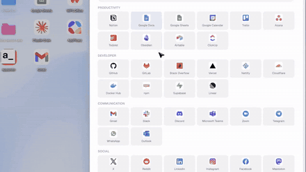
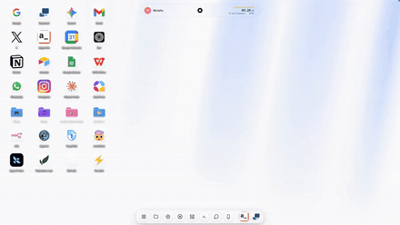
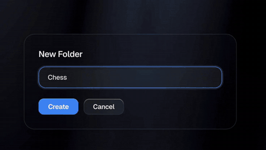
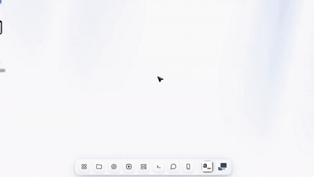
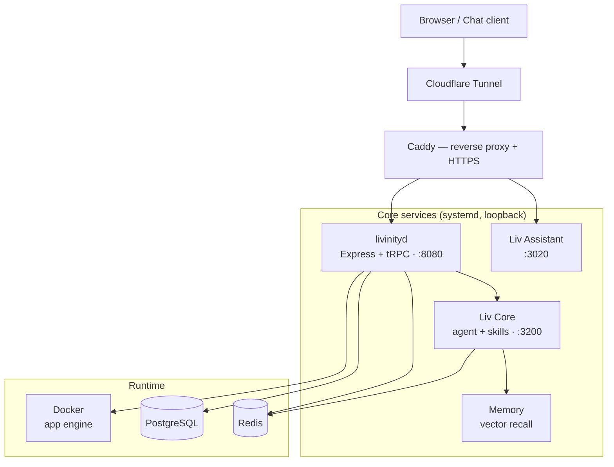

<div align="center">

<picture>
  <source media="(prefers-color-scheme: dark)" srcset="docs/media/logo-dark.svg" />
  
</picture>

# Livinity

### Your own cloud computer — self-hosted.

**A browser-based operating system, app store, and AI assistant that run on _your_ hardware.**
Nothing to install on your devices. Nothing to carry. Just sign in.

[Website](https://livinity.io) · [Quick Start](#quick-start) · [Live Demo](https://livinity.io) · [App Store](https://livinity.io/store) · [Developers](#for-developers)

[](./LICENSE)
[](https://github.com/utopusc/livinity-io/releases)
[](https://github.com/utopusc/livinity-io/stargazers)
[](https://github.com/utopusc/livinity-io/actions)
[](#liv--your-ai-assistant)

<br/>

<a href="#quick-start"></a>
<a href="https://livinity.io"></a>

<br/>
<br/>


</div>

---

## What is Livinity?

**Livinity is an open-source, self-hostable "Cloud AI Computer."** It's a complete operating system — desktop, app store, files, terminal, Docker, and an AI assistant named **Liv** — that runs on a Linux box you own and opens in any browser. Sign in from a laptop, phone, or tablet and your apps, files, and AI are simply _there_.

It's a private alternative to the stack of paid SaaS subscriptions you currently rent. Notion, Dropbox, Google Workspace, 1Password, Netflix, ChatGPT — each has a free, open-source equivalent, and Livinity installs them on **your own domain in one tap**, then lets Liv manage updates, backups, and settings for you.

- 🧠 **One assistant for everything** — ask Liv to install an app, find a file, run a job, or fix a setting. It does the work.
- 🔒 **Your data stays with you** — encrypted, exportable, no telemetry by default, no required cloud account.
- 🧩 **Modular & extensible** — Docker apps, a TypeScript skills SDK, an MCP server, and a fully-typed tRPC API.
- 🪪 **AGPL-3.0** — read it, fork it, run it. The door is always unlocked.

> **Two ways to run it.** This repository is the **free, self-hosted** edition — the same OS that powers [livinity.io](https://livinity.io), packaged to run on your hardware. Prefer zero setup? The **managed cloud** gives you the identical product with one sign-in → [livinity.io](https://livinity.io).

---

## See it in action

<div align="center">

<table>
  <tr>
    <td align="center" width="50%">
      <br/>
      <b>Liv — your AI assistant</b><br/>
      <sub>Install apps, search files, run jobs — by chat.</sub>
    </td>
    <td align="center" width="50%">
      <br/>
      <b>App Store</b><br/>
      <sub>One-click, Docker-based open-source apps.</sub>
    </td>
  </tr>
  <tr>
    <td align="center" width="50%">
      <br/>
      <b>Docker, no terminal required</b><br/>
      <sub>Containers, logs, images & stacks from the UI.</sub>
    </td>
    <td align="center" width="50%">
      <br/>
      <b>Files</b><br/>
      <sub>Browse, preview, stream, share. SMB & backups.</sub>
    </td>
  </tr>
  <tr>
    <td align="center" width="50%">
      <br/>
      <b>A real terminal in the browser</b><br/>
      <sub>Full shell — no SSH, no local setup.</sub>
    </td>
    <td align="center" width="50%">
      <br/>
      <b>Share & launch any app</b><br/>
      <sub>Per-app HTTPS domains and access control.</sub>
    </td>
  </tr>
</table>

</div>

---

## Features

| | |
|---|---|
| 🧠 **Liv** | A dashboard-native AI assistant that does real work — installs apps, searches files, runs background jobs, answers questions — with persistent, vector-embedding memory across sessions. Powered by **Anthropic Claude** (default) or **Google Gemini**, bring-your-own-keys. |
| 🛍️ **App Store** | One-click install of curated, Docker-based open-source apps (Jellyfin, Nextcloud, Immich, Vaultwarden, n8n, Home Assistant, Grafana, Ollama…), each with automatic HTTPS, health checks, and auto-restart. |
| 🗂️ **Files** | Web file browser with drag-and-drop upload, preview, and streaming, plus SMB/CIFS shares, snapshot/backup workflows, and USB/network storage auto-discovery. |
| 🖥️ **Terminal** | A full browser-based shell to drive the whole machine — no SSH, no local setup. Saved shortcuts let Liv re-run a flow with one click. |
| 🐳 **Docker** | Activate services, watch every container with live logs and health, pull images in the background, and compose multi-service stacks — all from the UI. |
| 👥 **Multi-user** | Multi-user mode with isolated per-user containers and per-user access control. |
| 💬 **Channels** | Talk to Liv outside the dashboard over **Telegram, Discord, and WhatsApp**. |
| 🔌 **Developer surface** | MCP server (drive your box from Claude Desktop / Cursor), a typed tRPC API, a hot-reload TypeScript **skills** SDK, plus webhook & scheduler primitives. |

### Every subscription has a free twin

Livinity is built around replacing recurring SaaS bills with self-hosted open source — installed and kept up to date for you:

| You're paying for | Livinity installs |
|---|---|
| Notion | AppFlowy |
| Google Workspace / Dropbox | Nextcloud · Syncthing |
| Netflix / Plex | Jellyfin |
| Google Photos | Immich |
| 1Password / LastPass | Vaultwarden |
| Spotify | Navidrome |
| Zapier | n8n |
| ChatGPT Plus | Open WebUI + Ollama |
| Grafana Cloud | Grafana · Uptime Kuma |

…and many more. See the full catalog in the [App Store](https://livinity.io/store).

---

## Quick Start

### Option A — Managed cloud (zero setup)

Sign up at **[livinity.io](https://livinity.io)** — one plan, **Livinity Pro**, at **$7.99/month** or **$69.99/year**, with a **3-day free trial**. You get your own `name.livinity.io` subdomain over a secure Cloudflare tunnel (no port forwarding), the full app store, and Liv built in. Bring your own AI keys; cancel anytime.

### Option B — Self-host (free, this repo)

One line, on any Linux box with `systemd`. Grab your install key from **[livinity.io/dashboard/install](https://livinity.io/dashboard/install)** (it provisions your subdomain + secure tunnel automatically), then:

```bash
curl -fsSL https://livinity.io/install.sh | sudo bash -s -- --api-key liv_k_YOURKEY
```

The installer provisions Docker, Caddy, PostgreSQL, Redis, and a Cloudflare tunnel, then brings the systemd services up (~10 minutes). When it finishes, open your subdomain and follow the onboarding wizard.

**Prefer to inspect before running** (recommended — it runs as root):

```bash
curl -fsSL https://livinity.io/install.sh -o livos-install.sh
less livos-install.sh                    # read it first
sudo bash livos-install.sh --api-key liv_k_YOURKEY
```

> **Fully independent?** You don't need a Livinity account to self-host — pass your own `--subdomain <name>` and `--cf-tunnel-token <token>` instead of `--api-key`. Liv still works with your own Claude/Gemini keys.

### System requirements

| Component | Minimum | Recommended |
|---|---|---|
| OS | Ubuntu 22.04 / Debian 12 (**systemd required**) | Ubuntu 24.04 LTS |
| RAM | 4 GB | 8 GB+ |
| Disk | 15 GB free | 25 GB+ |
| Node.js | 22 LTS _(auto-installed)_ | 22 LTS |
| Docker | Docker CE + Compose v2 _(auto-installed)_ | latest |
| Network | Outbound HTTPS only — **no public IP or port-forwarding** (works behind CGNAT) | — |

---

## Liv — your AI assistant

Liv is the brain of the OS. It's **bring-your-own-key** and provider-agnostic:

- **Anthropic Claude** (default) and **Google Gemini** for the assistant.
- **Local models** via the built-in **Ollama** + **Open WebUI** apps (Llama 3, Mistral, Gemma, Phi…).
- A growing roster of agent CLIs in the Liv workspace — **Claude Code, Gemini, Cursor, Codex, GitHub Copilot, Qwen, OpenCode, Goose, Kimi** and more.

Liv has **persistent memory** (vector embeddings) so context survives across sessions, executes **real tools** (apps, files, shell, Docker, background jobs) behind a configurable approval model, and reaches you on **Telegram, Discord, and WhatsApp**.

---

## The app library

The built-in catalog ships **31 one-click apps** across media, productivity, developer tools, automation, monitoring, AI, networking, security, and smart home — each a real Docker container with auto-HTTPS, health monitoring, and auto-restart:

**Media & photos** — Jellyfin · Navidrome · Calibre-Web · Immich
**Files & sync** — Nextcloud · Syncthing · File Browser
**Productivity** — Paperless-ngx · Wiki.js · Linkwarden · Homarr
**Developer** — Portainer · Code Server · Gitea · Hoppscotch · Stirling-PDF · Bolt.diy · Bytebot
**Automation & home** — n8n · Home Assistant
**Monitoring** — Uptime Kuma · Grafana
**AI** — Ollama · Open WebUI · MiroFish · Suna
**Networking & security** — AdGuard Home · WireGuard Easy · Vaultwarden · Element

Plus a wider marketplace of 200+ apps and a community-repository system for adding your own.

---

## How it works

Livinity is a TypeScript monorepo. **Caddy** is the only public front door; every service binds to loopback and is reached through a Cloudflare tunnel.



### Monorepo layout

```
livinity-io/
├── livos/                     # Platform (pnpm workspace)
│   └── packages/
│       ├── livinityd/         # Core daemon — Express + tRPC, orchestrates Docker/files/apps/AI
│       ├── ui/                # LivOS desktop UI — React 18 + Vite
│       ├── ui-kit/            # Shared React component library
│       ├── design-tokens/     # Design system (CSS vars, Tailwind preset, tokens)
│       ├── config/            # @livos/config — Zod-validated configuration
│       ├── cli/               # The `liv` CLI
│       ├── docker-agent/      # Manage Docker hosts behind NAT over WebSocket
│       ├── liv-ai-app/        # "Liv AI" Next.js app
│       └── marketplace/       # App-store / marketplace
│
├── liv/                       # AI agent runtime (npm workspace)
│   └── packages/
│       ├── core/              # Autonomous agent runtime / SDK runner
│       ├── memory/            # Long-term vector memory
│       ├── mcp-server/        # Model Context Protocol server
│       ├── worker/            # Background job worker
│       └── hooks/             # Lifecycle hooks
│
└── platform/web/             # livinity.io landing + dashboard + /api (deployed to Vercel)
```

### Services & ports

| Service | Port | Role |
|---|---|---|
| `caddy` | 80 / 443 | Reverse proxy + auto-HTTPS — the only public listener |
| `livos.service` (livinityd) | 8080 (loopback) | Apps, files, terminal, system & AI APIs |
| `liv-assistant.service` | 3020 (loopback) | Liv chat UI, served at `/liv` |
| `liv-core.service` | 3200 (loopback) | Agent runtime + tool execution |
| `liv-memory.service` | — | Vector memory store |
| `liv-worker.service` | — | Background jobs |
| `cloudflared` | outbound | Secure tunnel (no inbound ports) |
| `postgresql` · `redis-server` | 5432 · 6379 | Data + cache |

### Tech stack

| Layer | Technologies |
|---|---|
| Frontend | React 18, Vite, TypeScript 5.8, Tailwind CSS, Radix UI, Framer Motion, TanStack Query, tRPC, xterm.js, noVNC |
| Backend | Node.js 22, Express, tRPC, Zod, Drizzle ORM, ws, dockerode, node-pty |
| Data | PostgreSQL 16 (+ pgvector), Redis 7 |
| AI | Anthropic Claude (default), Google Gemini, Vercel AI SDK, MCP, Ollama (local) |
| Infra | Docker + Compose v2, Caddy, Cloudflare Tunnel, systemd, bubblewrap egress sandbox |
| Testing | Vitest, Playwright, ESLint, Prettier |

---

## For developers

Livinity is built to be driven by code and by AI:

- **MCP server** — point Claude Desktop or Cursor at your box and let your IDE manage apps, files, and Docker.
- **tRPC API** — a fully-typed surface over the daemon for your own clients and automations.
- **Skills SDK** — write hot-reloadable TypeScript "skills" to teach Liv new abilities.
- **Webhooks & scheduler** — primitives in the daemon for event- and time-driven jobs.

### Local development

```bash
git clone https://github.com/utopusc/livinity-io.git
cd livinity-io

# Platform (UI + daemon)
cd livos
pnpm install
pnpm --filter @livos/config build
pnpm --filter ui build

# AI agent core
cd ../liv
npm install && npm run build
```

Run the UI dev server from `livos`:

```bash
pnpm --filter ui dev   # http://localhost:3000
```

### Configuration

LivOS reads its config from `livos/.env`:

```bash
cd livos && cp .env.example .env
```

| Variable | Notes |
|---|---|
| `ANTHROPIC_API_KEY` | Claude key — primary AI provider |
| `GEMINI_API_KEY` | Google Gemini — alternative provider |
| `JWT_SECRET` | ≥ 32 bytes — `openssl rand -hex 32` |
| `LIV_API_KEY` | Internal service auth — `openssl rand -hex 32` |
| `DATABASE_URL` / `REDIS_URL` | Postgres DSN / Redis URL |

Domain and HTTPS are configured from the dashboard (**Settings → Domain Setup**) — no env vars required. Full reference: [`livos/.env.example`](livos/.env.example).

---

## Contributing

Contributions of every size are welcome — bug reports, fixes, new skills, app-store entries, and docs.

1. Fork the repo and branch (`git checkout -b feat/your-feature`).
2. Commit with [Conventional Commits](https://www.conventionalcommits.org/).
3. Open a PR with context and screenshots where it helps.

Please read [CONTRIBUTING.md](CONTRIBUTING.md) and our [Code of Conduct](CODE_OF_CONDUCT.md). A `secret-scan` GitHub Action runs on every push — keep credentials out of the tree.

---

## Security

Found a vulnerability? **Please don't open a public issue** — follow the responsible-disclosure process in [SECURITY.md](SECURITY.md).

Built-in protections include API-key auth with timing-safe comparison, JWT sessions with rotation, Caddy-managed HTTPS, per-user Docker isolation, and a bubblewrap + egress-allowlist sandbox for the AI agent.

---

## License

Livinity is licensed under the **GNU Affero General Public License v3.0 (AGPL-3.0)** — see [LICENSE](./LICENSE).

In plain words: use it personally or commercially, modify it, and ship it — but if you offer a modified version as a network service, you must publish your changes under AGPL-3.0. Network use counts as distribution.

---

## Links

- **Website** — [livinity.io](https://livinity.io)
- **App Store** — [livinity.io/store](https://livinity.io/store)
- **Issues** — [github.com/utopusc/livinity-io/issues](https://github.com/utopusc/livinity-io/issues)
- **Discussions** — [github.com/utopusc/livinity-io/discussions](https://github.com/utopusc/livinity-io/discussions)

<div align="center">
<br/>

Built with care by [@utopusc](https://github.com/utopusc) and the Livinity community.

<sub>Standing on the shoulders of Docker, TypeScript, Node.js, Anthropic, Google, and the open-source apps that make the library possible.</sub>

</div>
