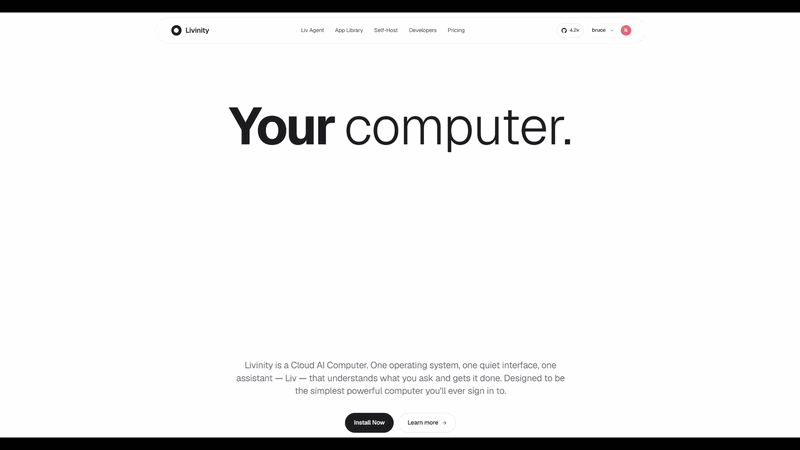
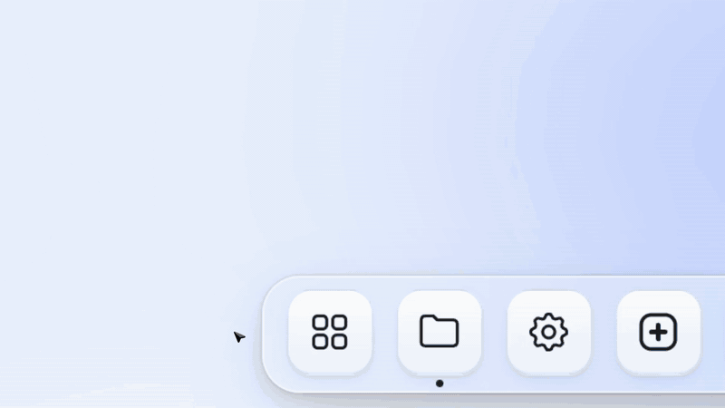
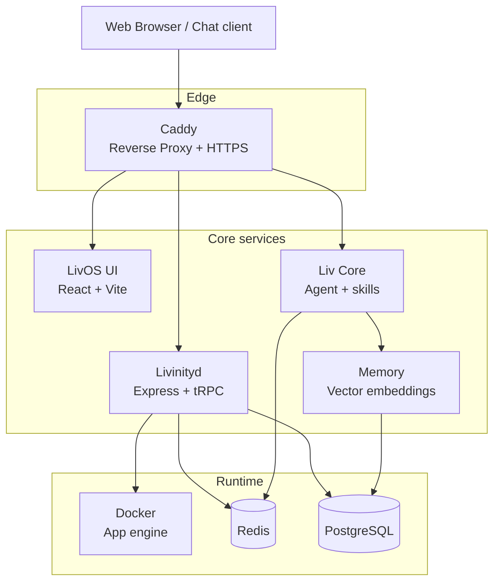

<div align="center">

# Livinity

### Your computer.

Livinity is a Cloud AI Computer. One operating system, one quiet interface,
one assistant — **Liv** — that understands what you ask and gets it done.

[**Website**](https://livinity.io) · [App Library](https://livinity.io/library) · [Developers](https://livinity.io/developers) · [Documentation](./docs)

<br/>



<br/>



<br/>

[](LICENSE)
[](https://nodejs.org/)
[](https://www.typescriptlang.org/)
[](CONTRIBUTING.md)
[](https://www.anthropic.com/claude)

</div>

---

## About this repository

`livinity-io` is the **open-source, self-host edition** of Livinity — the same
operating system that powers [livinity.io](https://livinity.io), packaged so
you can run it on your own hardware.

- **Same product as the cloud** — same UI, same Liv assistant, same app library
- **Your data stays with you** — no telemetry by default, no required cloud account
- **Modular and extensible** — Docker apps, skill plugins, MCP server, tRPC API
- **AGPL-3.0 licensed** — fork it, run it, ship it

> Looking for the managed experience? Visit [**livinity.io**](https://livinity.io)
> — zero install, one sign-in.

---

## Highlights

### Liv — your AI assistant

- Native chat in the dashboard plus optional channels (Telegram, Discord, WhatsApp)
- Real tool execution — install apps, search files, run background jobs, answer questions
- Persistent memory with vector embeddings — Liv remembers context across sessions
- Plugin "skills" system with hot-reload — extend Liv in TypeScript
- Powered by **Anthropic Claude** (default) with **Google Gemini** as an alternative

### App Library

- One-click install for 200+ curated, Docker-based apps
  (Nextcloud, Plex, Home Assistant, Jellyfin, n8n, AdGuard, Vaultwarden, …)
- Automatic HTTPS via Caddy + Let's Encrypt — including per-app custom domains
- Per-app sharing, health monitoring, and auto-restart
- Multi-user mode with isolated containers and per-user access control

### File system

- Web-based file browser with drag-and-drop upload, preview, and streaming
- SMB / CIFS network share support
- Integrated snapshot and backup workflow
- External storage (USB, network) auto-discovery

### Developer tools

- **MCP server** for Claude Desktop and Cursor IDE — let your AI IDE manage your server
- Fully-typed **tRPC API**
- Hot-reload skill development
- Webhook + scheduler primitives via the daemon

---

## Quick Start

### Requirements

| Component | Minimum | Recommended |
|---|---|---|
| OS | Ubuntu 22.04 / Debian 12 | Ubuntu 24.04 LTS |
| RAM | 2 GB | 8 GB+ |
| Storage | 20 GB | 100 GB+ NVMe |
| Node.js | 22.x | 22.x LTS |
| Docker | 24.x | Latest |

### One-line install

```bash
curl -fsSL https://get.livinity.io | bash
```

The installer provisions Docker, Caddy, PostgreSQL, and Redis, then brings
the systemd services up. When it finishes, open `http://<your-host>` and
follow the onboarding wizard.

### Verify before running (recommended)

`curl … | bash` runs whatever the remote serves **as root** with no integrity
check. Prefer **download → verify → run** so a compromised remote or TLS MITM
cannot silently run code on your host:

```bash
# 1. Download the script (don't pipe straight to a shell)
curl -fsSL https://get.livinity.io -o livos-install.sh

# 2. Print its checksum and compare against the published value
sha256sum livos-install.sh

# 3. Run only after the checksum matches
sudo bash livos-install.sh
```

To pin a specific release commit (fail-closed if the cloned tree does not match),
export `LIVOS_INSTALL_EXPECTED_SHA` before running — the installer refuses to
proceed when the cloned `HEAD` does not equal the pin, and logs the entry
script's `sha256sum` either way:

```bash
LIVOS_INSTALL_EXPECTED_SHA=<full-40-char-commit-sha> sudo bash livos-install.sh
```

Shipping a `scripts/install/EXPECTED_RELEASE` pin file in the release tree has
the same effect without needing the env var.

### Install entrypoint

The canonical, panel-issued install command is:

```bash
curl -fsSL https://livinity.io/install.sh | sudo bash -s <liv_k_API_KEY>
```

`livinity.io/install.sh` is served by the Vercel Next.js shim
`platform/web/src/app/install.sh/route.ts`, which fetches GitHub-raw
`scripts/install.sh` (**Path A**) — with a clone fallback to the **same**
`scripts/install.sh`. Path A runs `deploy-livinityd.sh`, which generates real
secrets and seeds `liv:mcp:config` (→ AionUi luse).

`get.livinity.io` is a **separate legacy Caddy host** (`154.12.245.35`) that
301-redirects `/install` to GitHub-raw `livos/install.sh` (**Path C**). It is
not the panel-issued entrypoint. As of Phase 252 R9, `livos/install.sh` also
seeds `liv:mcp:config` (idempotent, fail-soft port of the Path A seed), so the
legacy URL and the route.ts fallback no longer downgrade a fresh install to a
missing MCP catalog. The repo-root `/install.sh` (**Path B**, via
`scripts/install/env-seed.sh`) is an internal path and now writes
`openssl rand` secrets rather than `CHANGEME`. The live DNS/Vercel alias
confirmation is recorded in
`.planning/phases/252-fresh-install-portability-remediation/GET-LIVINITY-IO-RESOLUTION.md`.

### Manual install (developer mode)

```bash
git clone https://github.com/utopusc/livinity-io.git
cd livinity-io

# Platform (UI + daemon)
cd livos
pnpm install
pnpm --filter @livos/config build
pnpm --filter ui build

# Liv AI core
cd ../liv
npm install
npm run build

# Run via systemd
sudo systemctl start livos liv-core liv-worker liv-memory
```

For local hacking, run the dev server from the repo root:

```bash
cd livos && pnpm --filter ui dev   # http://localhost:3000
```

---

## Architecture



### Monorepo layout

```
livinity-io/
├── livos/                    # Platform (pnpm workspace)
│   ├── packages/
│   │   ├── livinityd/        # Core daemon (Express + tRPC)
│   │   ├── ui/               # Web UI (React 18 + Vite)
│   │   ├── config/           # @livos/config — shared schemas
│   │   └── marketplace/      # App catalog
│   └── skills/               # LivOS skill modules
│
└── liv/                      # AI agent (npm workspace)
    ├── packages/
    │   ├── core/             # Agent orchestration
    │   ├── memory/           # Embedding + recall service
    │   ├── mcp-server/       # MCP for Claude Desktop / Cursor
    │   ├── worker/           # Background task processing
    │   └── hooks/            # Lifecycle hooks
    └── skills/               # Liv skill modules
```

### Services (systemd)

| Service | Port | Description |
|---|---|---|
| `livos.service` | 8080 | Livinityd — apps, files, system APIs |
| `liv-core.service` | 3200 | Liv core — agent + tool execution |
| `liv-memory.service` | 3300 | Vector memory service |
| `liv-worker.service` | — | Background job processor |
| `caddy` | 80 / 443 | Reverse proxy with auto-HTTPS |

---

## Configuration

LivOS reads its config from `livos/.env`. Copy the example and tune:

```bash
cd livos && cp .env.example .env
```

The most important knobs:

| Variable | Default | Notes |
|---|---|---|
| `ANTHROPIC_API_KEY` | — | Claude API key — primary AI provider |
| `GEMINI_API_KEY` | — | Google Gemini — alternative provider |
| `JWT_SECRET` | — | Min 32 bytes. Generate: `openssl rand -hex 32` |
| `LIV_API_KEY` | — | Internal service auth. Generate: `openssl rand -hex 32` |
| `REDIS_URL` | `redis://localhost:6379` | URL-encode special chars in password |
| `DATABASE_URL` | — | PostgreSQL DSN (optional in development) |

Full reference: see [`livos/.env.example`](livos/.env.example).

**Domain and HTTPS** are configured from the dashboard
(Settings → Domain Setup) — no env vars required.

---

## Tech Stack

| Layer | Technologies |
|---|---|
| Frontend | React 18, Vite, TypeScript 5.7, Tailwind CSS, shadcn/ui, Framer Motion |
| Backend | Node.js 22, Express, tRPC, Zod |
| Data | PostgreSQL 16, Redis 7, vector embeddings |
| AI | Anthropic Claude (default), Google Gemini |
| Infra | Docker, Caddy, systemd |
| Testing | Vitest, React Testing Library, Playwright |

---

## Contributing

Contributions of all sizes are welcome — bug reports, fixes, new skills,
App Library entries, documentation improvements.

1. Fork the repo and create a feature branch
   (`git checkout -b feat/your-feature`)
2. Commit using
   [Conventional Commits](https://www.conventionalcommits.org/)
3. Open a Pull Request with context and screenshots where relevant

Please read [CONTRIBUTING.md](CONTRIBUTING.md) and our
[Code of Conduct](CODE_OF_CONDUCT.md).

---

## Security

If you discover a vulnerability, **please do not open a public issue.**
Follow the responsible-disclosure process in [SECURITY.md](SECURITY.md).

Security features include:

- API-key authentication for all internal services, with timing-safe comparison
- JWT session management with rotation support
- Caddy-managed HTTPS by default
- Per-user Docker isolation
- Auditable skill execution with a configurable allow-list

---

## License

Livinity is licensed under the
**GNU Affero General Public License v3.0 (AGPL-3.0)** — see
[LICENSE](LICENSE).

In plain words:

- Use it personally or commercially, anywhere
- Modify it, distribute it, ship it as part of your product
- If you offer a modified version as a network service,
  you must publish your modifications under AGPL-3.0
- Network use is considered distribution

---

## Links

- **Website** — [livinity.io](https://livinity.io)
- **App Library** — [livinity.io/library](https://livinity.io/library)
- **Issues** — [github.com/utopusc/livinity-io/issues](https://github.com/utopusc/livinity-io/issues)
- **Discussions** — [github.com/utopusc/livinity-io/discussions](https://github.com/utopusc/livinity-io/discussions)

---

## Acknowledgments

Livinity stands on the shoulders of giants:

- The Docker and OCI maintainers
- The TypeScript and Node.js teams
- Anthropic and Google for their AI APIs
- The countless open-source projects bundled in our App Library
- Everyone who has filed an issue, fixed a typo, or shipped a skill

<div align="center">

<br/>

Built with care by [@utopusc](https://github.com/utopusc) and the
Livinity community.

</div>
