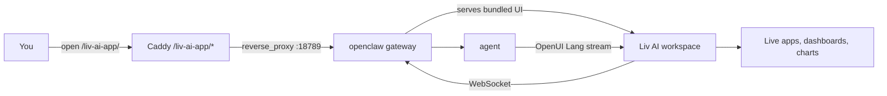

<div align="center">

# Liv AI — Generative UI workspace for LivOS

[](./LICENSE)

</div>

> **Fork notice.** This package is a LivOS-internal fork of
> [`thesysdev/openclaw-os`](https://github.com/thesysdev/openclaw-os) pinned at
> upstream commit [`076ae63`](./UPSTREAM-COMMIT). User-visible strings have been
> rebranded to "Liv AI"; wire-protocol identifiers (the `:openclaw-os`
> session-key suffix, the `openclaw-os-plugin` plugin id, the `/plugins/openclawos`
> HTTP route, the `openclawos.*` gateway RPC namespace, npm package names) are
> preserved unchanged so the package stays binary-compatible with an upstream
> `openclaw` gateway. See `AGENTS.md` for the protocol contract.

---

Liv AI is the workspace surface inside LivOS for the openclaw gateway. It reads
sessions, manages files, runs scripts, and schedules work across tools — and
renders agent responses as live, interactive apps (charts, tables, forms,
dashboards) that persist, refresh with new data, and update from a prompt
instead of a rebuild.

In LivOS, Liv AI replaces the previous Mastra + assistant-ui chat surface
(Phase 197–202). It is served by `liv-claw-gateway.service` on Mini PC port
18789 and reverse-proxied by Caddy at `/liv-ai-app/*`.

---

## What you get

- **A workspace, not a chat log.** Agents, sessions, apps, artifacts,
  notifications, and crons are first-class surfaces in the sidebar — structured
  and easy to navigate.
- **Live, interactive apps.** Agents render dashboards, charts, tables, and
  forms as React components that stream in as the model writes them. No
  copy-pasting JSON, no re-prompting for the same data.
- **Persistent and refinable.** Apps and artifacts are stored and re-rendered
  across turns. Update them with a prompt — they update in place instead of
  being regenerated from scratch.
- **Mobile + desktop.** Responsive UI; the same workspace works on a laptop,
  phone, or tablet.
- **Lives with the gateway.** Served directly by the openclaw gateway over the
  same-origin HTTP/WebSocket — no separate Next.js process, no tunnel, no CORS
  config.
- **Session-scoped prompt injection.** Only sessions opened from Liv AI receive
  the OpenUI Lang system prompt. CLI runs and other gateway clients are
  unaffected.

---

## How it works

Liv AI ships as a single openclaw plugin. When the gateway loads it, two things
happen:

1. **The workspace UI is served from the gateway** at
   `http://<gateway>/plugins/openclawos`. The plugin bundles the prebuilt
   static export of the web client and serves it over the gateway's own HTTP
   route.
2. **Agent runs from Liv AI get an OpenUI prompt.** A `before_prompt_build`
   hook detects sessions originating from the workspace (by session-key
   suffix `:openclaw-os`) and prepends an OpenUI Lang system prompt, so the
   LLM emits structured component markup the workspace can render.

The workspace then connects back to the same gateway over the same-origin
WebSocket and renders the streaming output as live React components.



See [`AGENTS.md`](./AGENTS.md) for the full protocol, plugin detection, and the
agent / session / thread mental model.

---

## Packages

| Package | Role |
| :--- | :--- |
| [`@openuidev/openclaw-os-plugin`](./packages/claw-plugin) | The openclaw plugin. Bundles the workspace UI, serves it over the gateway's HTTP route, and injects the OpenUI prompt for Liv AI sessions. |
| [`@openuidev/claw-client`](./packages/claw-client) | The workspace UI itself — a Next.js app rendered with the OpenUI React renderer. Statically exported, then bundled into the plugin. |

> The npm package names above are preserved from upstream so the plugin remains
> loadable by an upstream openclaw gateway. The pnpm workspace name of THIS
> container directory is `@livos/liv-claw-os`.

Both packages live in this monorepo and are linked via pnpm workspaces.

---

## Repository structure

```
liv-claw-os/
├── packages/
│   ├── claw-client/      # Workspace UI (Next.js, statically exported)
│   └── claw-plugin/      # openclaw plugin (bundles + serves the UI)
├── scripts/              # Local helpers (open dashboard, tunnel setup)
├── AGENTS.md             # Protocol and mental-model deep dive
├── CONTRIBUTING.md       # Upstream development workflow (informational)
├── UPSTREAM-COMMIT       # Pinned upstream SHA (076ae63)
└── README.md             # You are here
```

Good places to start:

- [`packages/claw-client`](./packages/claw-client) — the workspace UI
- [`packages/claw-plugin`](./packages/claw-plugin) — the plugin that ships and serves it
- [`AGENTS.md`](./AGENTS.md) — gateway protocol & session model

---

## Scripts

Run from THIS directory — every script fans out across the inner pnpm
workspace.

```bash
pnpm build         # build every package
pnpm lint          # ESLint check across packages
pnpm lint:fix      # ESLint auto-fix
pnpm format        # Prettier check
pnpm format:fix    # Prettier write
pnpm typecheck     # tsc --noEmit across packages
pnpm test          # Vitest across packages
pnpm ci            # full lint + format + typecheck + build (matches CI)
```

---

## Powered by OpenUI

The workspace renders agent output using [OpenUI](https://openui.com), an open
standard for generative UI. Agents emit OpenUI Lang — a structured, streamable
language designed for model-generated UI:

- **Streaming output** — components render incrementally as tokens arrive.
- **Token efficient** — up to 67% fewer tokens than equivalent JSON.
- **Controlled rendering** — agents can only emit the components defined in
  the workspace's library.
- **Typed component contracts** — props are declared up front with Zod schemas.

See the [OpenUI documentation](https://openui.com) for details.

---

## Upstream

This fork tracks [`thesysdev/openclaw-os`](https://github.com/thesysdev/openclaw-os).
Cross-reference upstream commits when debugging — folder names (`claw-client`,
`claw-plugin`, `engines/openclaw/`), class names (`OpenClawEngine`,
`OpenClawPluginToolContext`), wire-protocol identifiers, and CSS selectors are
preserved on purpose so `git diff` against upstream stays readable.

## License

MIT, inherited from upstream — see [`LICENSE`](./LICENSE) and
[`AGENTS.md`](./AGENTS.md) for attribution details.
